# C971 Mobile Application Development Using C Sharp

# Environment

```
git clone https://gitlab.com/wgu-gitlab-environment/student-repos/tbui45/c971-mobile-application-development-using-c-sharp.git
```
- Visual Studio 2022
- .NET 8.0
- Android emulator - Pixel 5 - API 34
- Only the CoursePlanner, Lib, and ViewModels projects are necessary to run the app and can be removed if needed. You can run the tests with `dotnet test` for your convenience.

# C6 Evaluation
- Go into the navigation drawer and navigate to the dev utils page.
- If there is already data in on the terms page when you first opened the app, use the "reset" option to clear the database.
- After restarting the app, use the "Create C6 Test Data" option.

# Wireframe
- See the attached image file in submission.

# Git log
- See the attached text file in submission.


# Rebase warning

- Note that while rebasing the commits I moved the commits around in an arbitrary order. Commits preceding the `Rebase` tag are (almost) guaranteed to be broken if checking that particular version commit out.

# Installation

- Take note of the currently open GitHub issue for MAUI preventing CLI usage: [maui #5975](https://github.com/dotnet/maui/issues/5975)

- Open Visual Studio 2022 (or community edition)
- Click on `Clone a repository`

- 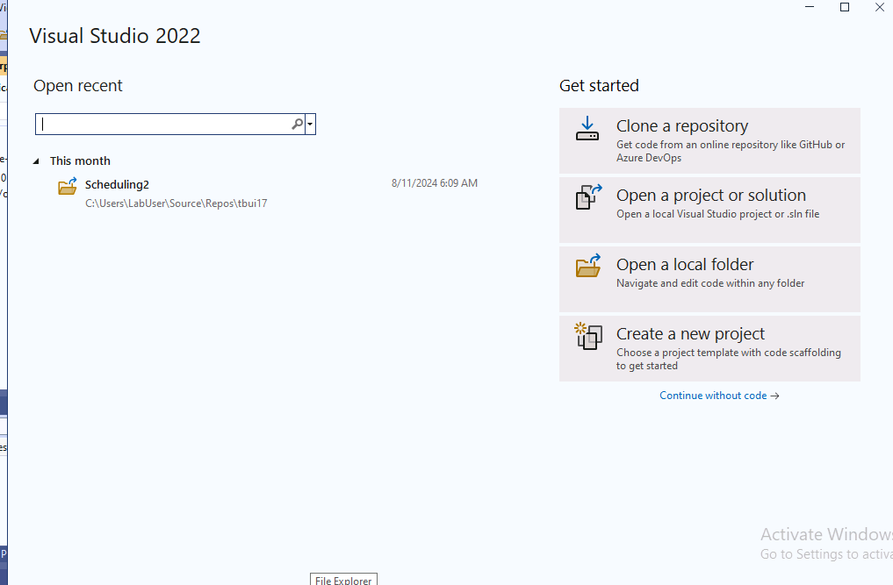

- Copy link `https://gitlab.com/wgu-gitlab-environment/student-repos/tbui45/c971-mobile-application-development-using-c-sharp.git` into the URL field

- 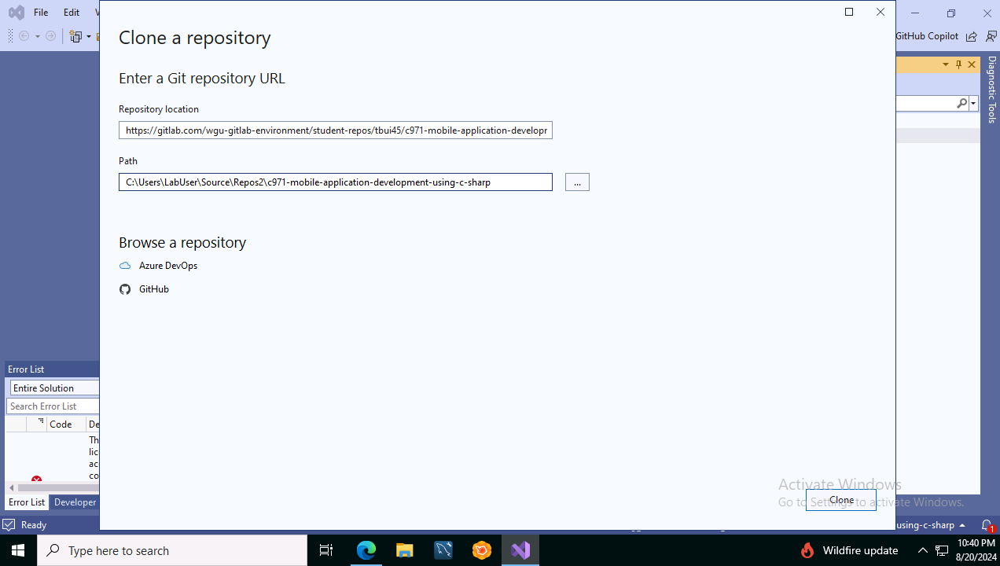
- The path is where the folder will be placed. Note that I changed the parent directory from `Repos` to `Repos2`. This is because I already have an existing clone in `Repos`, so I am changing the parent directory to `Repos2` to avoid conflicts.
- Click on `Clone`
- Click on `Manage branches`

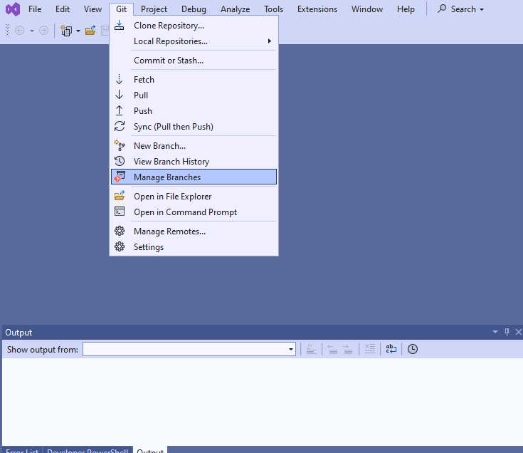

- Click the `Expand` arrow to see the remote branches if it isn't already open.

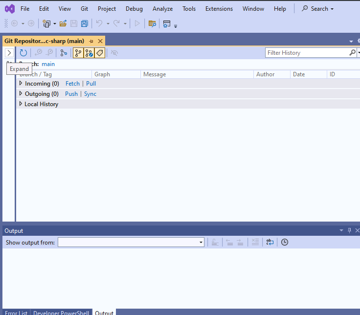

- Click on the `working` branch and click on `Checkout`.

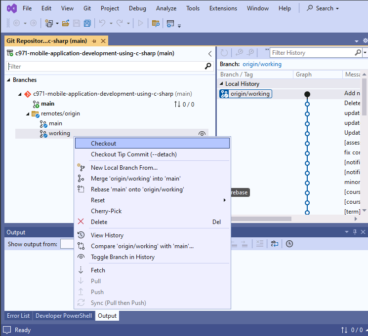

- Click on Right click the folder view and click `Open` if the project isn't already visible. Otherwise, open it to populate the solution explorer then enter the solution view. 

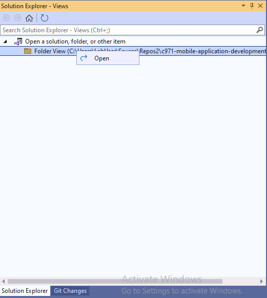

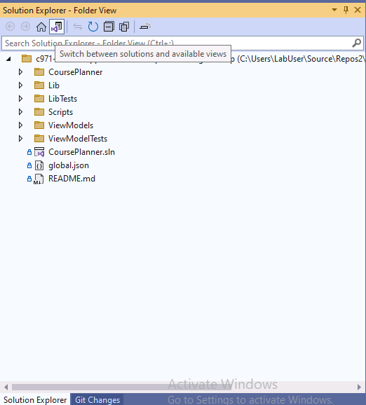

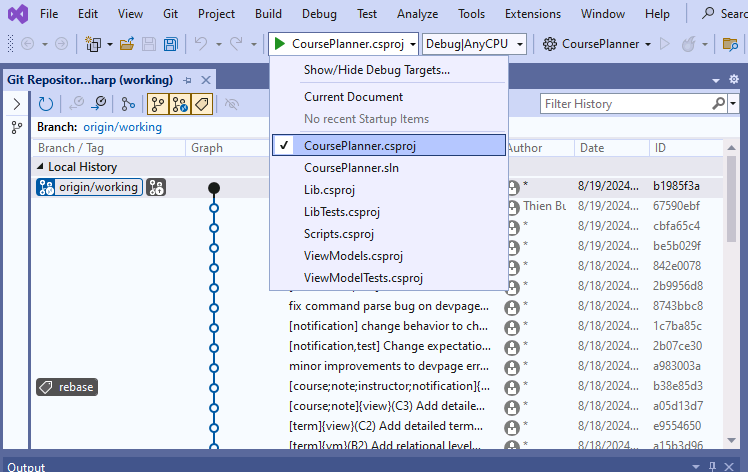

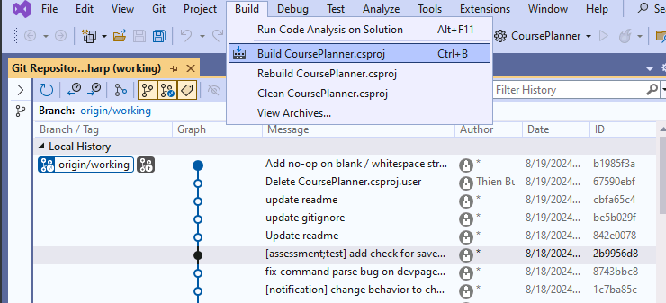

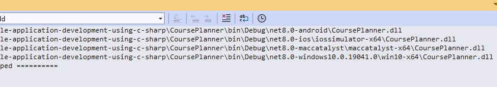

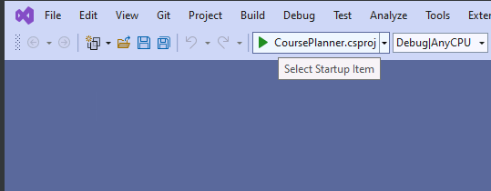

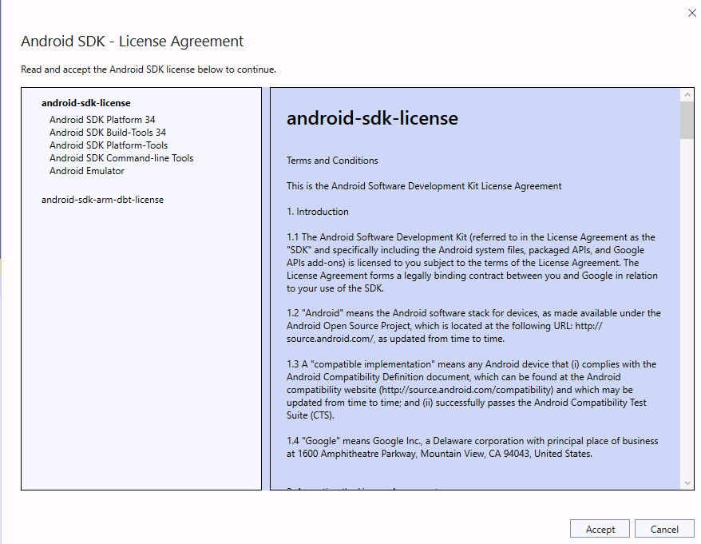

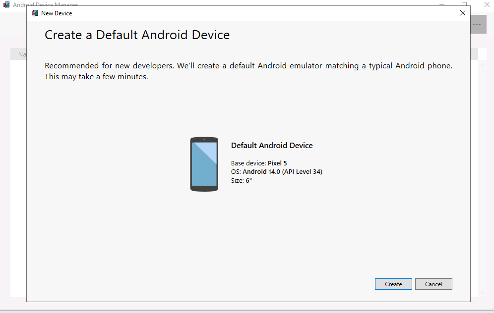

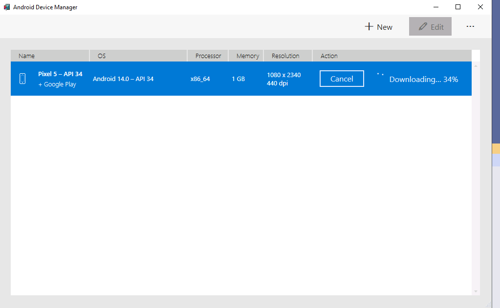

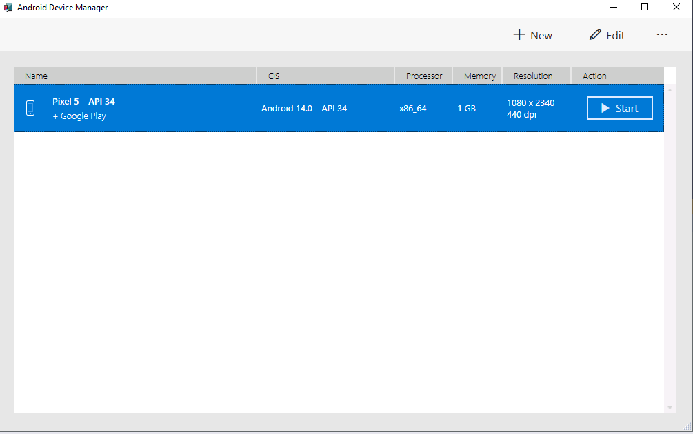

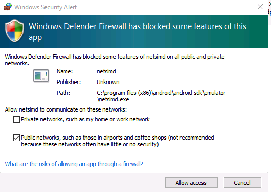

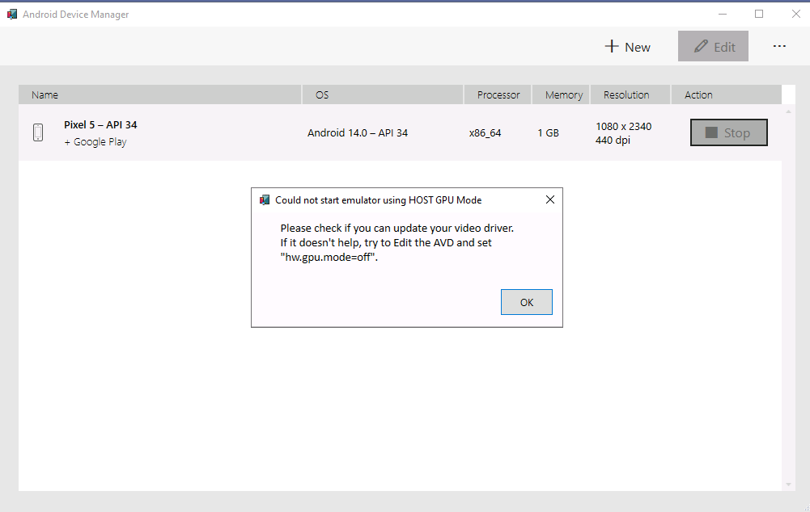